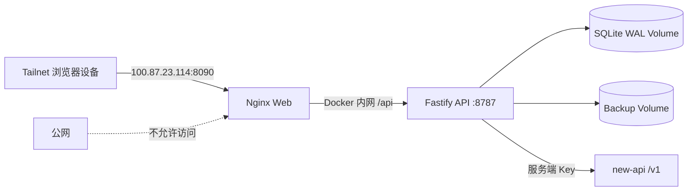

# diy-nav-web 私有书签中心

这是基于 `slightlee/diy-nav-web` 的单用户私有分支。书签、分类、标签和导入任务统一存储在 ARM VPS 的 SQLite 中，tailnet 内所有设备实时共享，不再使用浏览器 `localStorage`、Cloudflare D1/R2、OAuth 或应用登录。

上游固定版本见 [UPSTREAM.md](UPSTREAM.md)。

运行故障处理见 [TROUBLESHOOTING.md](TROUBLESHOOTING.md)。

## 功能

- SQLite WAL 中心库，书签/分类/标签完整 CRUD。
- 每条记录带 `version`，旧设备提交过期数据时返回 `409 VERSION_CONFLICT`。
- 导入浏览器 Netscape Bookmark HTML 和项目 JSON。
- 上传后预览有效、重复、异常链接，保留文件名、文件夹路径和标题。
- 通过服务端 new-api 网关生成精简分类体系、单个复用标签和简短中文描述。
- AI 分类任务持久化，API 重启后恢复；输出经过 JSON Schema 和 Zod 校验。
- 支持状态筛选、逐条审核、批量分类/标签、批量排除，并在单个 SQLite 事务中提交。
- JSON 导出、SQLite 一致性快照、SHA-256、12 份轮转和恢复校验。
- API 不映射宿主机端口；Web 仅绑定 Tailscale IP。

## 技术栈

- Node.js 20
- pnpm 8.8.0
- Vue 3 + Vite + Pinia
- Fastify 5 + Zod
- better-sqlite3
- Docker Compose

## 架构



API 不发布宿主机端口。公网隔离仍需同时由 Tailscale 地址绑定、防火墙和云安全组保证。

## 本地开发

```bash
nvm use
corepack enable
corepack prepare pnpm@8.8.0 --activate
pnpm install
cp .env.example .env
pnpm dev
```

访问入口：

- Web: `http://127.0.0.1:3000`
- SQLite: `./data/diy-nav.sqlite`

本地开发时，Web 会将 `/api` 请求代理到后端服务，无需直接访问 API 端口。

`.env` 中的 new-api 配置只由 API 读取：

```dotenv
AI_NEW_API_BASE_URL=http://<new-api-tailnet-ip>:<port>/v1
AI_NEW_API_KEY=<server-only-key>
AI_DEFAULT_MODEL=
```

浏览器不会收到 `AI_NEW_API_KEY`。没有配置 AI 时，中心库和手工导入审核仍可使用。

## API

主要端点：

| 方法           | 路径                             | 用途                   |
| -------------- | -------------------------------- | ---------------------- |
| `GET/POST`     | `/api/bookmarks`                 | 列表、新建书签         |
| `PATCH/DELETE` | `/api/bookmarks/:id`             | 带版本更新、删除       |
| `GET/POST`     | `/api/categories`                | 分类 CRUD              |
| `GET/POST`     | `/api/tags`                      | 标签 CRUD              |
| `POST`         | `/api/imports`                   | 上传文件内容并生成预览 |
| `PUT`          | `/api/imports/:id/taxonomy`      | 确认分类体系           |
| `POST`         | `/api/imports/:id/classify`      | 启动持久化 AI 分类任务 |
| `PATCH`        | `/api/imports/:id/items/:itemId` | 审核单条记录           |
| `POST`         | `/api/imports/:id/commit`        | 事务提交审核结果       |
| `GET`          | `/api/ai/models`                 | 从 new-api 获取模型    |
| `GET`          | `/api/export/json`               | 版本化 JSON 导出       |
| `GET`          | `/api/metrics`                   | 非敏感运行指标         |
| `GET`          | `/healthz`, `/readyz`            | 进程与 SQLite 健康检查 |

## ARM VPS 部署

目标地址固定为 `100.87.23.114:8090`。`8080` 和 `8787` 不会占用宿主机端口。

```bash
cp .env.example .env
chmod 600 .env
sh deploy/deploy.sh
```

Compose 行为：

- Web: `${TAILSCALE_IP:-100.87.23.114}:${WEB_PORT:-8090}:80`
- API: 仅 `expose: 8787`，只在 Compose 网络中可见
- SQLite/WAL: `diy-nav-data` volume
- 快照/JSON: `diy-nav-backups` volume
- 重启策略: `unless-stopped`
- 日志轮转: 3 x 10 MB
- API: Node 20 Debian slim，支持 x86_64/ARM64 原生 SQLite 构建

验证：

```bash
docker compose -f deploy/docker-compose.yml ps
curl http://100.87.23.114:8090/api/bookmarks
ss -lnt | grep -E '(:8090|:8787)'
```

预期只有 `100.87.23.114:8090` 对外监听，没有宿主机 `8787`。还应在 VPS 防火墙/云安全组中拒绝公网访问 `8090`。

## 备份

手工创建 SQLite 一致性快照、JSON 导出和 SHA-256：

```bash
sh deploy/backup.sh
```

容器内 `/backups` 只保留最近 12 组文件。安装 VPS 定时器后，每月 1 日和 16 日执行：

```bash
sudo cp deploy/systemd/diy-nav-backup.* /etc/systemd/system/
sudo systemctl daemon-reload
sudo systemctl enable --now diy-nav-backup.timer
```

检查：

```bash
systemctl list-timers diy-nav-backup.timer
docker exec diy-nav-api ls -lh /backups
```

## 本地副本

脚本通过 Tailscale SSH 从容器拉取备份，并在本地保留 12 组：

```bash
DIY_NAV_REMOTE=root@100.87.23.114 sh deploy/local-backup-sync.sh
```

安装 user timer：

```bash
mkdir -p ~/.config/systemd/user
cp deploy/systemd/diy-nav-local-sync.* ~/.config/systemd/user/
systemctl --user daemon-reload
systemctl --user enable --now diy-nav-local-sync.timer
```

`Persistent=true` 会在离线设备下次开机联网后补跑。

## 恢复

先列出快照：

```bash
docker exec diy-nav-api ls -1 /backups/'diy-nav-'*.sqlite
```

恢复指定快照：

```bash
sh deploy/restore.sh /backups/diy-nav-<timestamp>.sqlite
```

恢复脚本会：

1. 在覆盖前执行快照 `integrity_check`。
2. 停止 API，替换 SQLite 主文件并移除旧 WAL/SHM。
3. 再次执行 `integrity_check`。
4. 输出书签、分类、标签数量。
5. 重启 API 和 Web。

## 验证

```bash
pnpm --filter api test
pnpm type-check
pnpm build
docker compose -f deploy/docker-compose.yml config
```

测试覆盖 HTML/JSON 解析、URL 规范化、重复检测、迁移、CRUD、版本冲突、导入预览和事务提交。

## 安全边界

- 本项目没有应用级认证，整个 tailnet 都拥有完整读写权限。
- 不应通过公网反向代理或 `0.0.0.0:8090` 暴露。
- API 和 SQLite 不映射宿主机端口。
- `.env` 不进入镜像或 JSON 导出，AI Key 可独立轮换。

## License

MIT，沿用上游许可证。
